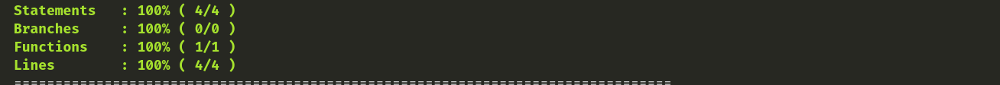
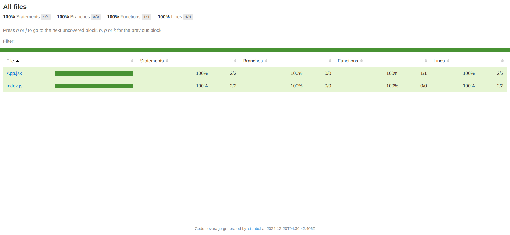

# Cypress Boilerplate

A boilerplate project setup for end-to-end testing using [Cypress](https://www.cypress.io/), designed for fast and efficient testing of web applications.

## Features

- Preconfigured Cypress setup for e2e testing.
- Integrated with Webpack for custom build configurations.
- Supports modern JavaScript.
- Includes Babel for transpilation.

## Prerequisites

Before setting up the project, ensure you have the following installed:

- [Node.js](https://nodejs.org/) (>= 14.x recommended)
- npm (Node Package Manager)

## Getting Started

### 1. Clone the Repository

### 2. Install Dependencies

Using npm:

```bash
npm install
```

### 3. Run Cypress Tests

First run your react app using

```bash
npm run start
```

To open the Cypress Test Runner:

```bash
npm run cy:open
```

## Project Structure

```plaintext
cypress-boilerplate/
├── cypress/
│   ├── fixtures/        # Test data files
│   ├── e2e/             # E2E tests
│   ├── component/       # Component tests
│   └── support/         # Custom commands and configurations
├── public/              # Static files
├── src/                 # Source code for the app (if applicable)
├── .babelrc             # Babel configuration
├── cypress.json         # Cypress configuration
├── package.json         # Project metadata and dependencies
└── webpack.common.js    # Webpack configuration
```

## Configuration

### Cypress Configuration

Edit the `cypress.json` file to customize:

```json
{
  "baseUrl": "http://localhost:3000",
  "viewportWidth": 1280,
  "viewportHeight": 720,
  "defaultCommandTimeout": 8000
}
```

## Writing Tests

1. Create test files in the `cypress/e2e` folder for e2e tests.
2. Example Test:

```javascript
describe("My First Test", () => {
  it("Visits the app and checks the title", () => {
    cy.visit("/");
    cy.title().should("include", "Your App Name");
  });
});
```

### To get code coverage report

```bash
npx nyc report --reporter=text-summary
```



To see the code coverage on your browser, run the `index.html` file located inside the `coverage/lcov-report` directory using Live Server.


